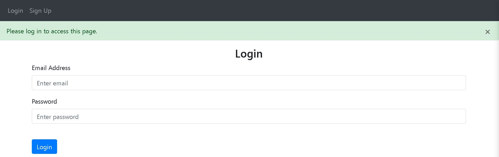
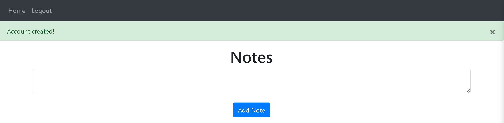
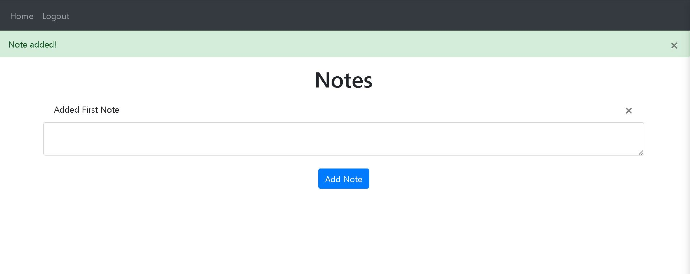

# Flask Notes App Tutorial

Welcome to the Simple flask app with login! Follow these steps to set up, install dependencies, run the app, and view it in your browser.

## Table of Contents
- [Setup & Installation](#setup--installation)
- [Running The App](#running-the-app)
- [Viewing The App](#viewing-the-app)
- [Screenshots](#screenshots)

## Setup & Installation

1. **Clone the Repository:**
   ```bash
   git clone https://github.com/fahamidur/simple-webapp-with-login.git
   cd simple-webapp-with-login
   ```

2. **Install Dependencies:**
   ```bash
   pip install -r requirements.txt
   ```

## Running The App

Now that you have the app and its dependencies installed, let's run it!

```bash
python main.py
```

## Viewing The App

Open your web browser and navigate to [http://127.0.0.1:5000](http://127.0.0.1:5000).

You should now see the Flask Notes App up and running. If it's your first time, you might want to create an account, log in, and start adding notes.

## Screenshots
<!-- Add your screenshots here. -->

*LogIn Page*


*Dashboard for adding Notes*


*Notes Added*

